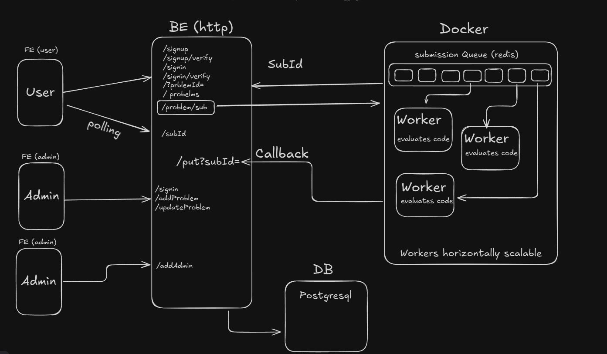

# Cloud IDE

Cloud IDE is an online code execution platform that allows users to submit code for evaluation against predefined test cases. It features **Judge0** for execution, **passwordless OTP-based authentication**, **role-based access control (RBAC)**, and **server-side caching** to optimize performance.

## 🚀 Features
- **Code Evaluation:** Executes user-submitted code using **Judge0** with asynchronous result handling.
- **Secure Authentication:** Implements **passwordless OTP-based login** with a **one-minute expiration**.
- **Role-Based Access Control (RBAC):**
  - **Super Admin:** Manages admins and has full platform control.
  - **Admins:** Create, edit, and delete problems.
- **Optimized Performance:**
  - **Server-side caching** reduces database queries.
  - **Judge0 instances run in Docker** with **horizontally scalable workers**.
- **RESTful APIs:** Seamless interaction between frontend and backend.

## 🛠️ Tech Stack
- **Frontend:** React (TypeScript)
- **Backend:** Express (TypeScript)
- **Database:** PostgreSQL with Prisma ORM
- **Code Execution:** Judge0 API (Dockerized & horizontally scalable workers)

## 🔥 Usage
1. **Sign up using OTP authentication** (passwordless login).
2. **Super Admin assigns Admin roles.**
3. **Admins create and manage coding problems.**
4. **Users submit code for evaluation,** and results are displayed after execution.

## 📌 Future Enhancements
- **Real-time collaborative coding**
- **AI-powered code suggestions**
- **Custom test case submissions**

## 🤝 Contributing
Feel free to submit issues or pull requests to improve Cloud IDE!

## 📜 License
This project is licensed under the **MIT License**.

---
🚀 **Cloud IDE – Efficient, Secure & Scalable Online Coding Platform**
